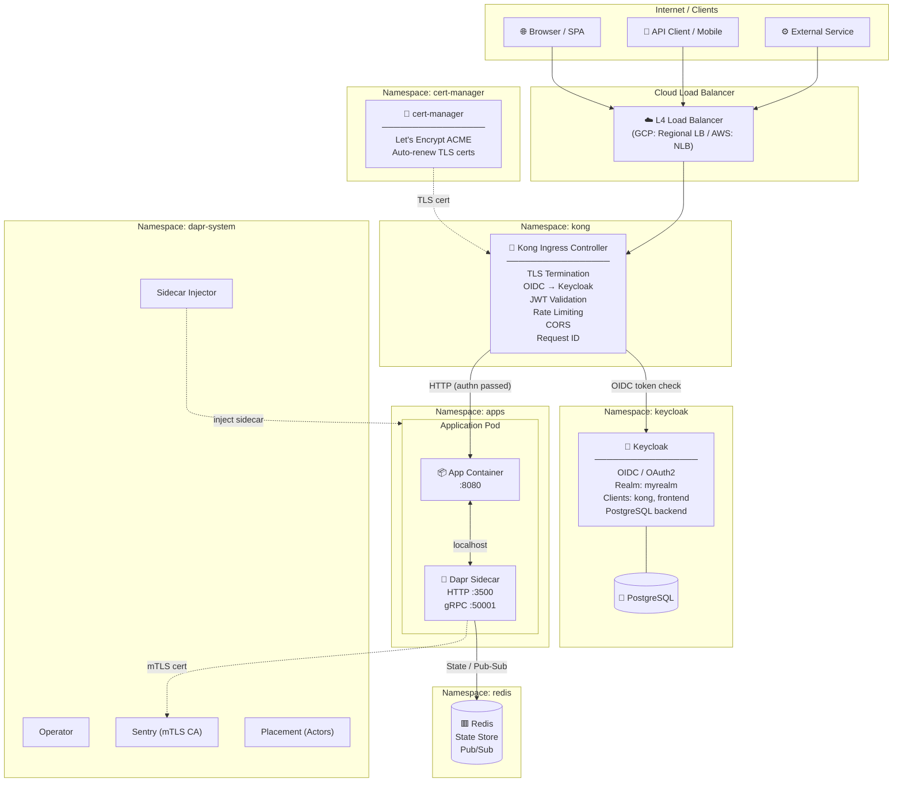
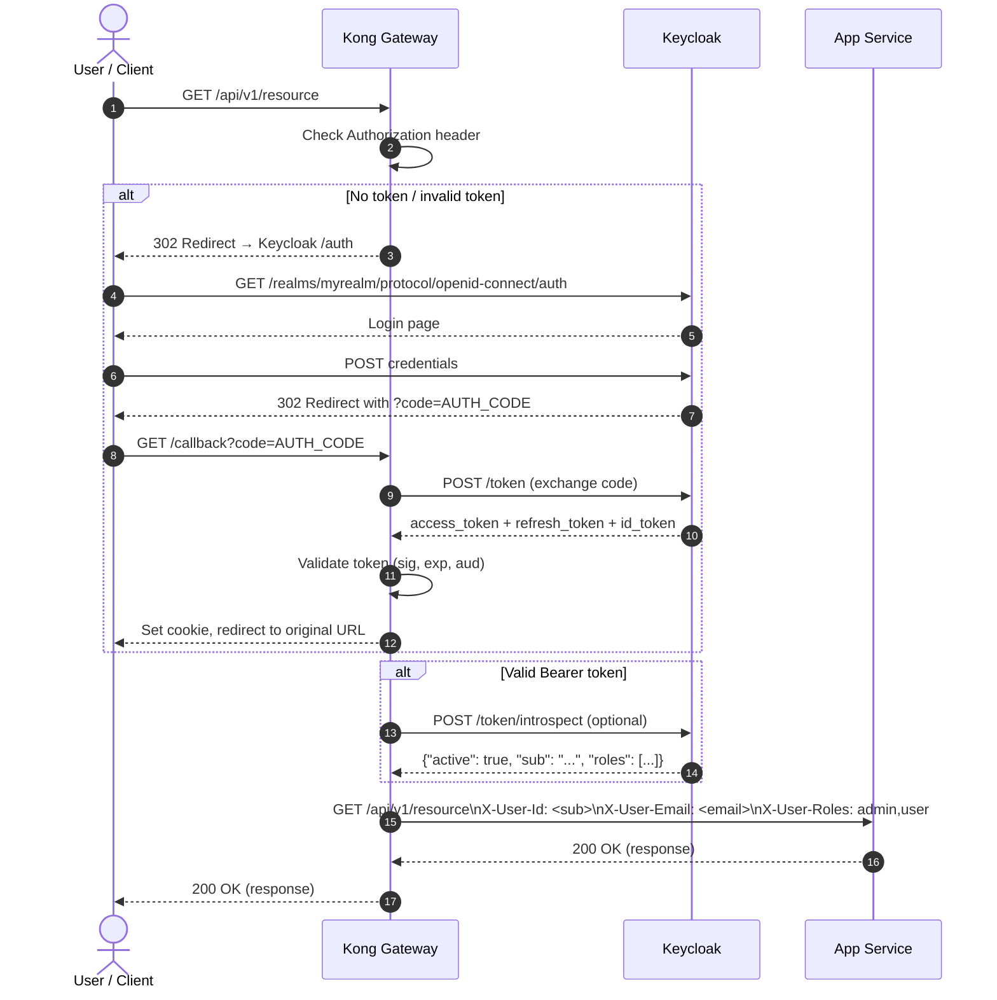
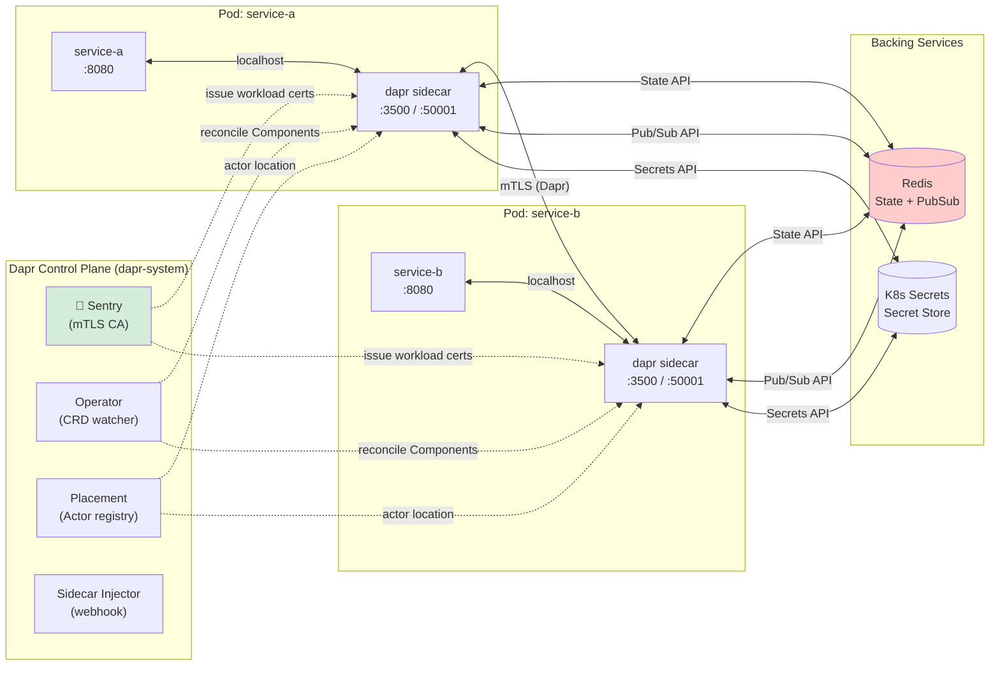
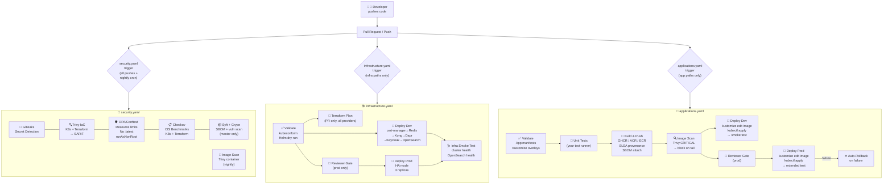
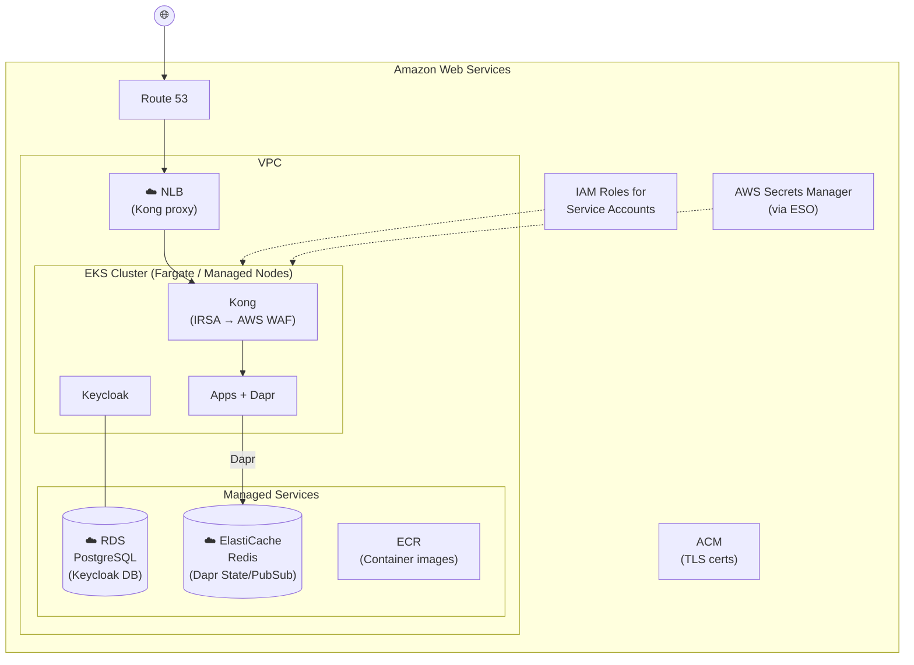
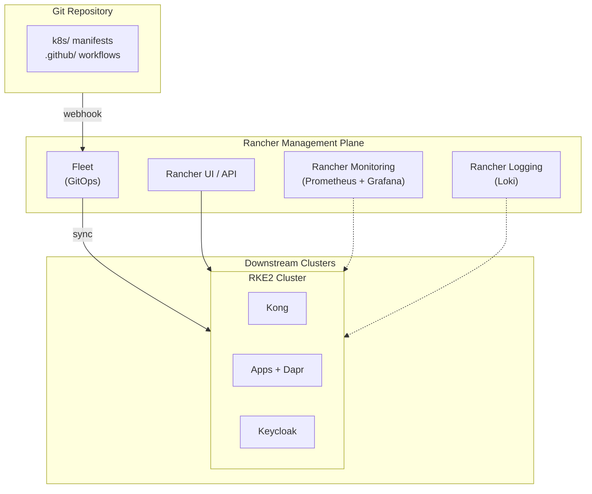
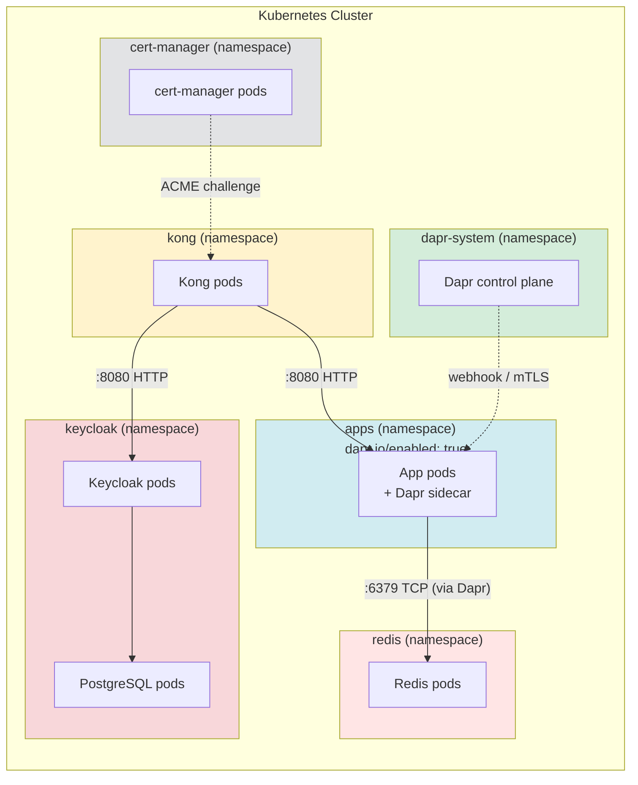
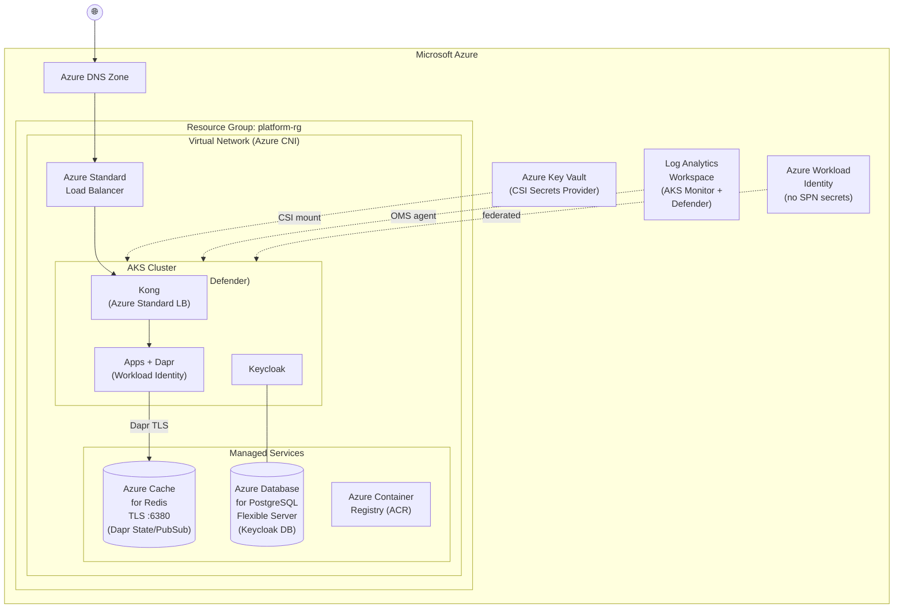
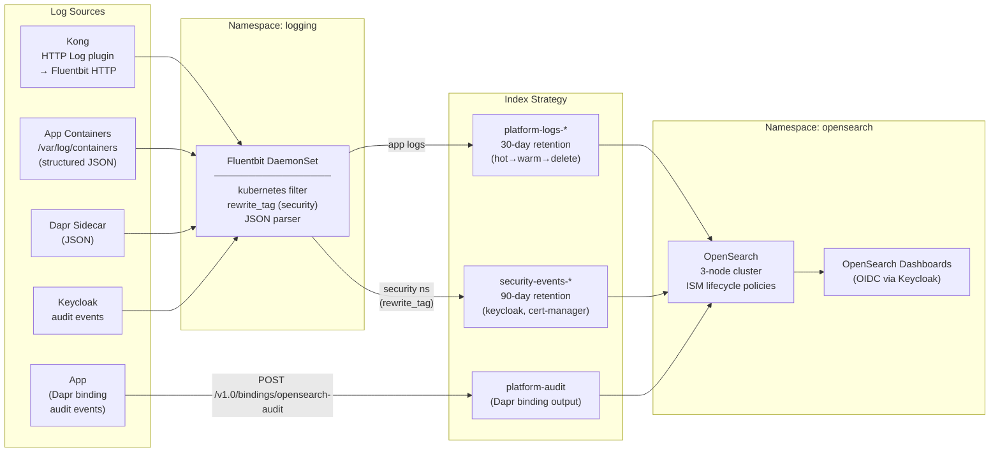

# Platform Diagrams

All diagrams use [Mermaid](https://mermaid.js.org/) and render natively on GitHub.

---

## 1. Overall Platform Architecture



---

## 2. Authentication Flow (OIDC via Kong + Keycloak)



---

## 3. Dapr Runtime Architecture



---

## 4. CI/CD Pipelines (Segregated)

Three independent pipelines, each with a single responsibility and its own trigger filters.



### Pipeline responsibility matrix

| Concern | security.yaml | infrastructure.yaml | applications.yaml |
|---------|:---:|:---:|:---:|
| Secret / credential leak detection | ✅ | | |
| IaC misconfiguration scan | ✅ | | |
| OPA policy enforcement | ✅ | | |
| CIS benchmark checks | ✅ | | |
| SBOM generation | ✅ | | |
| Manifest validation (infra) | | ✅ | |
| Terraform plan / validate | | ✅ | |
| Helm chart deployments | | ✅ | |
| Kong / Dapr / Keycloak deploy | | ✅ | |
| OpenSearch / Fluentbit deploy | | ✅ | |
| App manifest validation | | | ✅ |
| Container image build & push | | | ✅ |
| Container vulnerability scan | | | ✅ |
| App deployment (Kustomize) | | | ✅ |
| Rollback on failure | | | ✅ |

---

## 5. Cloud Provider Topology

### Google Cloud Platform (GKE)

```mermaid
graph TB
    subgraph GCP["Google Cloud Platform"]
        subgraph VPC["VPC Network"]
            subgraph Region["Region: us-central1"]
                subgraph GKE["GKE Autopilot Cluster"]
                    direction TB
                    Kong2["Kong\n(Workload Identity\n→ Cloud Armor)"]
                    Apps2["Apps + Dapr"]
                    KC2["Keycloak"]
                end

                subgraph ManagedSvcs["Managed Services"]
                    CloudSQL[("☁️ Cloud SQL\nPostgreSQL\n(Keycloak DB)"]
                    Memorystore[("☁️ Memorystore\nRedis\n(Dapr State/PubSub)"]
                    ArtifactReg["Artifact Registry\n(Container images)"]
                end

                GCLB["☁️ Cloud Load Balancer\n+ Cloud Armor WAF"]
            end
        end

        CloudDNS["Cloud DNS"]
        CertAuth["Google-Managed\nCertificates\n(or cert-manager\n+ Let's Encrypt)"]
        WorkloadID["Workload Identity\n(no key files)"]
        SecretMgr["Secret Manager\n(via ESO or\nDapr secret store)"]
    end

    Internet(("🌐")) --> CloudDNS --> GCLB --> Kong2
    Kong2 --> Apps2
    KC2 --- CloudSQL
    Apps2 -->|Dapr| Memorystore
    WorkloadID -.-> GKE
    SecretMgr -.-> GKE
```

### Amazon Web Services (EKS)



### Rancher (Cloud-Agnostic)



---

## 6. Namespace & Network Policy



---

## 7. Azure (AKS) Topology



---

## 8. Observability — Log Flow (OpenSearch)



---

## 9. Maltego Transform Hub — Auth & Execution Flow

```mermaid
sequenceDiagram
    autonumber
    actor Op as Maltego Operator
    participant KC as Keycloak<br/>(maltego-hub realm)
    participant Hub as Transform Hub<br/>(FastAPI)
    participant T as Transform Logic<br/>(dnspython / RDAP / ip-api)

    rect rgb(240,248,255)
        Note over Op,Hub: One-time registration (admin scope required)
        Op->>Hub: POST /api/v1/clients/register<br/>Authorization: Bearer &lt;admin-token&gt;<br/>{"client_name": "alice-laptop"}
        Hub->>KC: POST /admin/realms/maltego-hub/clients<br/>(Keycloak Admin API)
        KC-->>Hub: 201 Created
        Hub-->>Op: {client_id, client_secret, token_url, instructions}
    end

    rect rgb(255,248,240)
        Note over Op,KC: Token acquisition (Maltego does this automatically)
        Op->>KC: POST /realms/maltego-hub/protocol/openid-connect/token<br/>grant_type=client_credentials<br/>scope=transforms:execute
        KC-->>Op: {access_token, expires_in: 300}
    end

    rect rgb(240,255,240)
        Note over Op,T: Transform discovery (import once into Maltego)
        Op->>Hub: GET /api/v2/manifest<br/>Authorization: Bearer &lt;token&gt;
        Hub-->>Op: {transforms: [...], tokenUrl, hubUrl}
        Note over Op: Maltego imports all transforms<br/>from manifest automatically
    end

    rect rgb(248,240,255)
        Note over Op,T: Transform execution
        Op->>Hub: POST /api/v2/transforms/DomainToIP<br/>Authorization: Bearer &lt;token&gt;<br/>Content-Type: application/xml<br/>&lt;MaltegoMessage&gt;...&lt;/MaltegoMessage&gt;
        Hub->>Hub: Validate JWT<br/>• RS256 sig vs JWKS<br/>• aud = transform-hub<br/>• scope: transforms:execute<br/>• exp not expired
        Hub->>T: DomainToIP.run(entity="example.com")
        T->>T: dns.resolver.resolve("example.com", "A")
        T-->>Hub: [IPv4Address: 93.184.216.34]
        Hub-->>Op: &lt;MaltegoTransformResponseMessage&gt;<br/>  &lt;Entity Type="maltego.IPv4Address"&gt;<br/>    &lt;Value&gt;93.184.216.34&lt;/Value&gt;<br/>  &lt;/Entity&gt;<br/>&lt;/MaltegoTransformResponseMessage&gt;
    end
```
