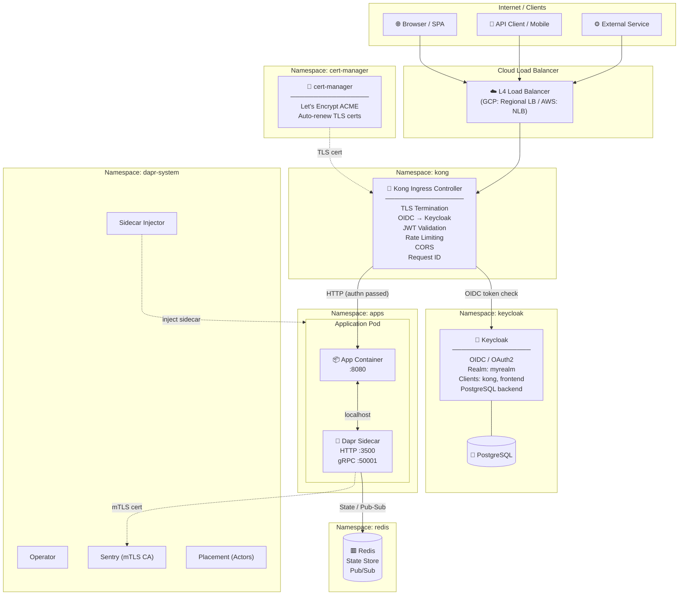
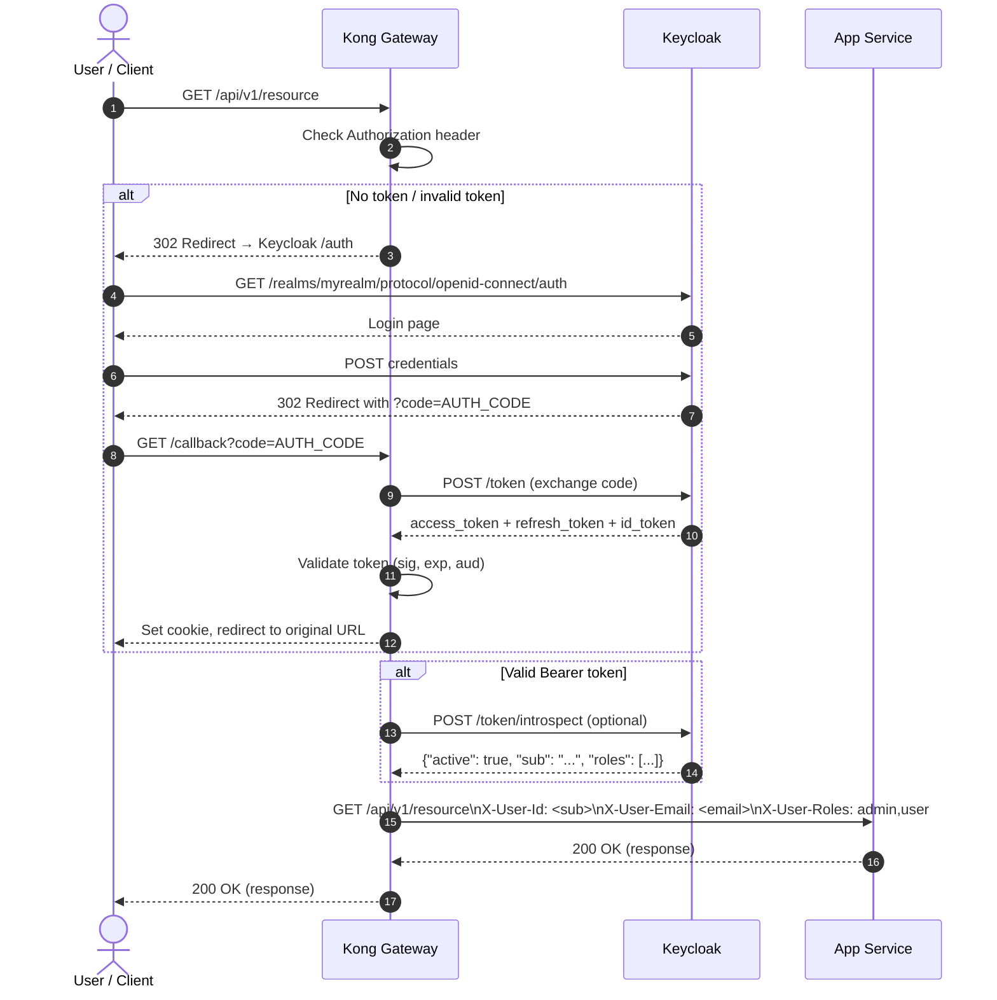
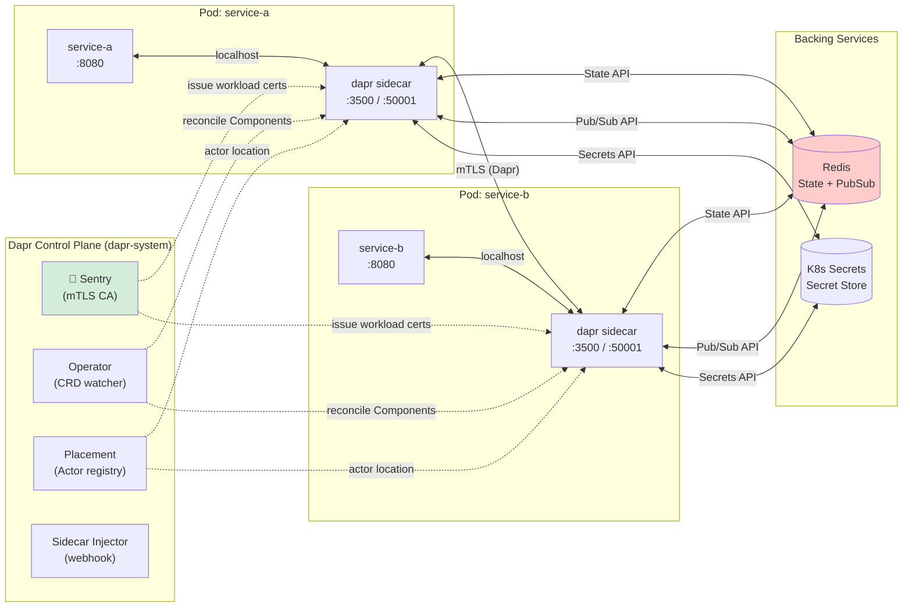
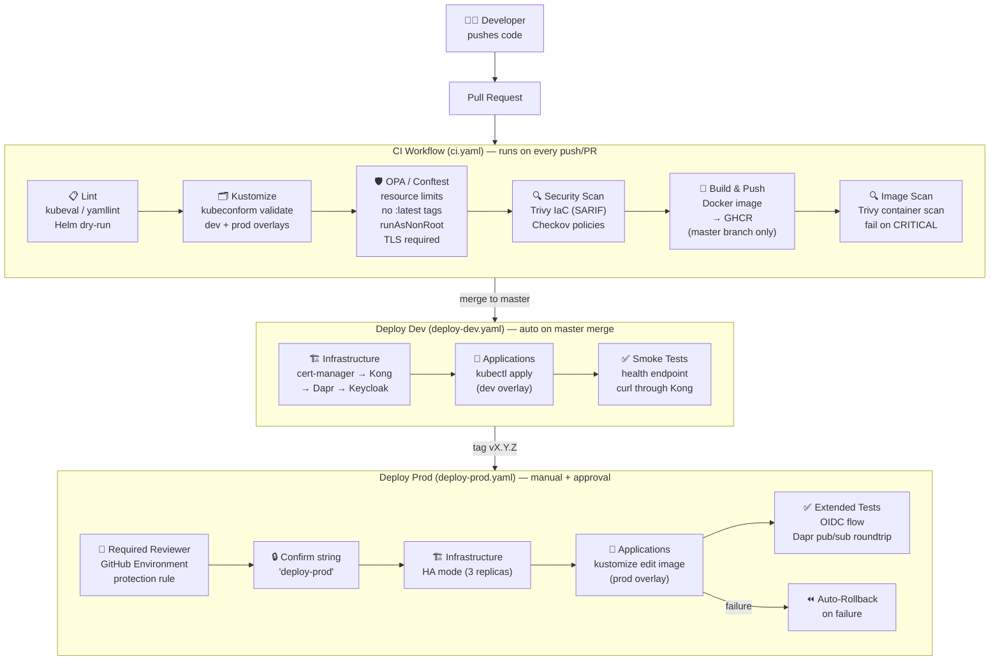
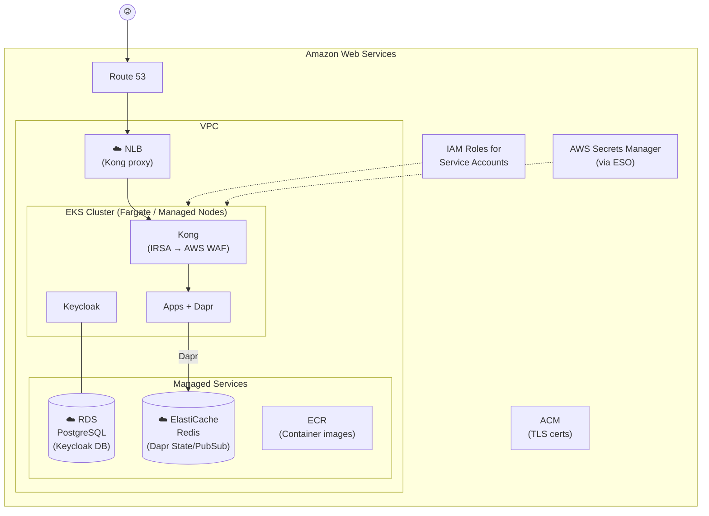
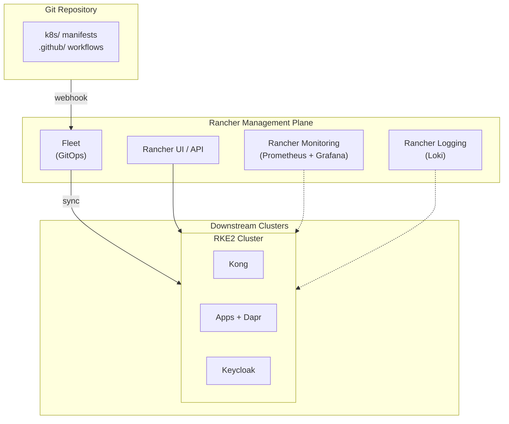
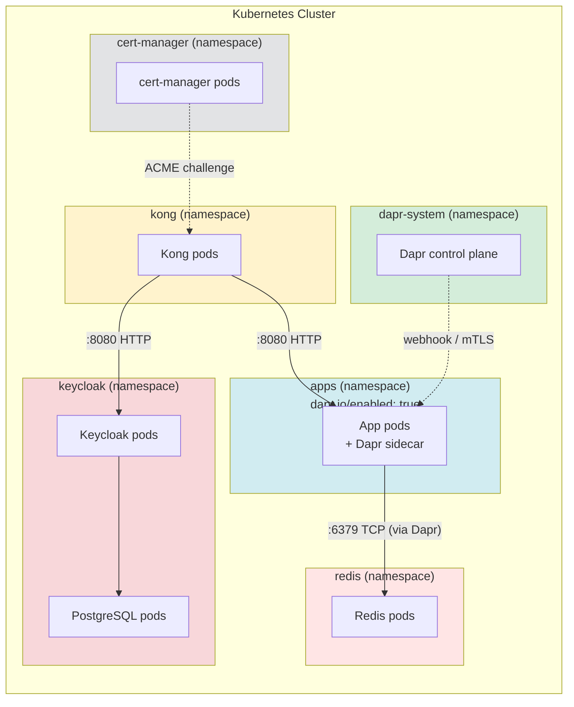

# Platform Diagrams

All diagrams use [Mermaid](https://mermaid.js.org/) and render natively on GitHub.

---

## 1. Overall Platform Architecture



---

## 2. Authentication Flow (OIDC via Kong + Keycloak)



---

## 3. Dapr Runtime Architecture



---

## 4. CI/CD Pipeline



---

## 5. Cloud Provider Topology

### Google Cloud Platform (GKE)

```mermaid
graph TB
    subgraph GCP["Google Cloud Platform"]
        subgraph VPC["VPC Network"]
            subgraph Region["Region: us-central1"]
                subgraph GKE["GKE Autopilot Cluster"]
                    direction TB
                    Kong2["Kong\n(Workload Identity\n→ Cloud Armor)"]
                    Apps2["Apps + Dapr"]
                    KC2["Keycloak"]
                end

                subgraph ManagedSvcs["Managed Services"]
                    CloudSQL[("☁️ Cloud SQL\nPostgreSQL\n(Keycloak DB)"]
                    Memorystore[("☁️ Memorystore\nRedis\n(Dapr State/PubSub)"]
                    ArtifactReg["Artifact Registry\n(Container images)"]
                end

                GCLB["☁️ Cloud Load Balancer\n+ Cloud Armor WAF"]
            end
        end

        CloudDNS["Cloud DNS"]
        CertAuth["Google-Managed\nCertificates\n(or cert-manager\n+ Let's Encrypt)"]
        WorkloadID["Workload Identity\n(no key files)"]
        SecretMgr["Secret Manager\n(via ESO or\nDapr secret store)"]
    end

    Internet(("🌐")) --> CloudDNS --> GCLB --> Kong2
    Kong2 --> Apps2
    KC2 --- CloudSQL
    Apps2 -->|Dapr| Memorystore
    WorkloadID -.-> GKE
    SecretMgr -.-> GKE
```

### Amazon Web Services (EKS)



### Rancher (Cloud-Agnostic)



---

## 6. Namespace & Network Policy


