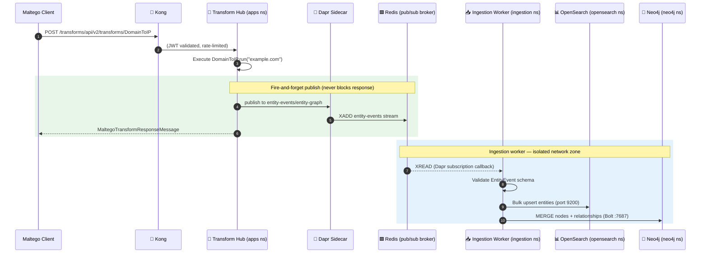

# Managed Ingestion Flows — OpenSearch & Neo4j

This document describes how transform result entities are persistently stored in
**OpenSearch** (full-text search + analytics) and **Neo4j** (graph relationships),
following a strict mapping schema, from network zones that are isolated from the
business code that produced them.

See [diagrams.md](./diagrams.md) for the platform layer model and network zone diagram.

---

## Design Goals

| Goal | How it is achieved |
|------|--------------------|
| Business code never talks to datastores | NetworkPolicy + Dapr component scoping |
| Schema is the single source of truth | `schema.py` drives OS mappings + Neo4j constraints |
| Duplicate entities are merged, not duplicated | Deterministic doc IDs (OS) + MERGE Cypher (Neo4j) |
| Adding a new entity type requires no code change | Add one `EntityMapping` to `schema.py` |
| Adding a new relationship requires no code change | Add one `RelationshipMapping` to `schema.py` |
| Writes to OS and Neo4j are independent | Failures in one do not affect the other |
| Ingestion scales independently of transforms | Separate Deployment + HPA in `ingestion` namespace |

---

## Architecture



### Network Zone Isolation

```
┌─────────────────────────────────────────────────────────────────┐
│ Namespace: apps                                                  │
│   transform-hub → Dapr sidecar → pub/sub                        │
│   NetworkPolicy: NO egress to opensearch:9200 or neo4j:7687      │
└──────────────────────────────┬──────────────────────────────────┘
                               │ Redis Streams (pub/sub)
┌──────────────────────────────▼──────────────────────────────────┐
│ Namespace: ingestion                                             │
│   ingestion-worker → Dapr sidecar                               │
│   NetworkPolicy: egress ONLY to opensearch:9200, neo4j:7687      │
│                  NO egress to internet or other app namespaces   │
└───────────┬──────────────────────────────────────┬──────────────┘
            │ HTTP :9200                            │ Bolt :7687
┌───────────▼────────────┐            ┌────────────▼────────────┐
│ Namespace: opensearch  │            │ Namespace: neo4j        │
│   NetworkPolicy:       │            │   NetworkPolicy:        │
│   DENY all except      │            │   DENY all except       │
│   ingestion + logging  │            │   ingestion namespace   │
└────────────────────────┘            └─────────────────────────┘
```

---

## Mapping Schema

The schema lives in `src/ingestion-worker/schema.py` and is the **single source of truth**
for how Maltego entity types are stored in both datastores.

### Entity Mapping

Each Maltego entity type has one `EntityMapping`:

```python
"maltego.Domain": EntityMapping(
    # OpenSearch: which index and what field types
    opensearch_index="entities-domain",
    opensearch_fields={
        "value":           OSField("keyword"),
        "whois_registrar": OSField("keyword"),
        "whois_created":   OSField("date"),
        "sources":         OSField("keyword"),
        "first_seen":      OSField("date"),
        "last_seen":       OSField("date"),
    },
    # Neo4j: what node label and which property is the merge key
    neo4j_label="Domain",
    neo4j_id_property="value",
    neo4j_properties=[
        Neo4jProperty("value", "value"),
    ],
),
```

### Relationship Mapping

Relationships are keyed by `(transform_name, input_entity_type, output_entity_type)`:

```python
("DomainToIP", "maltego.Domain", "maltego.IPv4Address"): RelationshipMapping(
    rel_type="RESOLVES_TO",
    source_label="Domain",
    target_label="IPAddress",
),
("DomainToWHOIS", "maltego.Domain", "maltego.Person"): RelationshipMapping(
    rel_type="REGISTERED_BY",
    source_label="Domain",
    target_label="Person",
),
```

The ingestion worker automatically creates these directed relationships in Neo4j
when it processes a transform result.

### Currently mapped entity types

| Maltego Type | OpenSearch Index | Neo4j Label | Merge Key |
|-------------|-----------------|-------------|-----------|
| `maltego.Domain` | `entities-domain` | `Domain` | `value` |
| `maltego.IPv4Address` | `entities-ip` | `IPAddress` | `value` |
| `maltego.MXRecord` | `entities-mx` | `MXRecord` | `value` |
| `maltego.URL` | `entities-url` | `URL` | `value` |
| `maltego.Person` | `entities-person` | `Person` | `value` |
| `maltego.EmailAddress` | `entities-email` | `EmailAddress` | `value` |
| `maltego.PhoneNumber` | `entities-phone` | `PhoneNumber` | `value` |
| `maltego.Organization` | `entities-organization` | `Organization` | `value` |
| `maltego.Location` | `entities-location` | `Location` | `value` |
| `maltego.AS` | `entities-asn` | `AutonomousSystem` | `value` |

### Currently mapped relationships

| Transform | Input | Output | Neo4j Edge |
|-----------|-------|--------|-----------|
| `DomainToIP` | Domain | IPAddress | `RESOLVES_TO` |
| `DomainToMX` / `DomainToMXRecord` | Domain | MXRecord | `HAS_MX` |
| `URLToDomain` | URL | Domain | `HOSTED_ON` |
| `URLToDomain` | URL | IPAddress | `RESOLVES_TO` |
| `DomainToWHOIS` | Domain | Person | `REGISTERED_BY` |
| `DomainToWHOIS` | Domain | Organization | `REGISTERED_BY` |
| `DomainToWHOIS` | Domain | EmailAddress | `CONTACT_EMAIL` |
| `DomainToWHOIS` | Domain | PhoneNumber | `CONTACT_PHONE` |
| `IPToGeolocation` | IPAddress | Location | `GEOLOCATED_IN` |
| `IPToGeolocation` | IPAddress | AutonomousSystem | `BELONGS_TO_ASN` |
| `IPToGeolocation` | IPAddress | Organization | `OPERATED_BY` |

---

## Adding a New Entity Type

1. Open `src/ingestion-worker/schema.py`.
2. Add an `EntityMapping` to `ENTITY_SCHEMA`:
   ```python
   "maltego.Certificate": EntityMapping(
       opensearch_index="entities-certificate",
       opensearch_fields={
           "value":       OSField("keyword"),
           "issuer":      OSField("keyword"),
           "not_after":   OSField("date"),
           "san":         OSField("keyword"),
           "fingerprint": OSField("keyword"),
       },
       neo4j_label="TLSCertificate",
       neo4j_id_property="value",
       neo4j_properties=[
           Neo4jProperty("value",       "value"),
           Neo4jProperty("fingerprint", "fingerprint", required=False),
       ],
   ),
   ```
3. If the transform that produces this entity should create a relationship, add to `RELATIONSHIP_SCHEMA`:
   ```python
   ("DomainToCert", "maltego.Domain", "maltego.Certificate"): RelationshipMapping(
       rel_type="SECURED_BY",
       source_label="Domain",
       target_label="TLSCertificate",
   ),
   ```
4. Push — the ingestion worker picks up the schema at startup. Neo4j constraints are
   created automatically via `ensure_constraints()`.

No other files need to change.

---

## OpenSearch Document Model

Each entity becomes a document with a **deterministic ID** = `sha256(type + "::" + value)`.
This means:
- The same entity observed by multiple transforms produces one document, not many.
- `first_seen` is set on creation and never overwritten.
- `last_seen` is updated on every observation.
- `sources` is a keyword array that accumulates transform names (deduplicated via Painless script).

Example document in `entities-domain`:
```json
{
  "_id": "a3f4...b12",
  "_source": {
    "entity_type": "maltego.Domain",
    "value": "example.com",
    "whois_registrar": "GoDaddy",
    "sources": ["DomainToWHOIS", "DomainToIP"],
    "first_seen": "2024-01-15T10:00:00Z",
    "last_seen":  "2024-03-20T14:30:00Z"
  }
}
```

Indexes use `"dynamic": false` — only fields declared in the schema are indexed.
Unknown fields from transforms are silently ignored, preventing mapping explosions.

---

## Neo4j Graph Model

Nodes use `MERGE ON` to guarantee uniqueness per `(label, id_property)`.
Relationships use `MERGE` so the same edge is created exactly once even if
the transform runs repeatedly.

Example Cypher queries:

```cypher
// Find all IP addresses a domain resolves to
MATCH (d:Domain {value: "example.com"})-[:RESOLVES_TO]->(ip:IPAddress)
RETURN ip.value, ip.country, ip.asn

// Find all domains registered by the same person
MATCH (p:Person)-[:REGISTERED_BY]-(d:Domain)
WHERE p.value CONTAINS "smith"
RETURN d.value, p.value

// Shortest path between two entities
MATCH path = shortestPath(
  (start:Domain {value: "evil.com"})-[*]-(end:Organization {value: "Acme Corp"})
)
RETURN path

// Find pivot points (high-degree nodes)
MATCH (n)
WHERE size([(n)-[]-() | 1]) > 5
RETURN labels(n), n.value, size([(n)-[]-() | 1]) as degree
ORDER BY degree DESC
LIMIT 20
```

---

## Deploying

### Prerequisites

```bash
# Add Neo4j Helm repo
helm repo add neo4j https://helm.neo4j.com/neo4j
helm repo update

# Create Neo4j auth secret
kubectl create secret generic neo4j-auth \
  --from-literal=NEO4J_AUTH="neo4j/$(openssl rand -base64 24)" \
  -n neo4j

# Create ingestion worker secrets
kubectl create secret generic ingestion-worker-secrets \
  --from-literal=opensearch-password="<opensearch-admin-password>" \
  --from-literal=neo4j-password="<neo4j-password>" \
  -n ingestion
```

### Install Neo4j

```bash
helm install neo4j neo4j/neo4j \
  --namespace neo4j \
  --values k8s/neo4j/helm-values.yaml
```

### Apply network policies and ingestion manifests

```bash
kubectl apply -f k8s/neo4j/network-policy.yaml
kubectl apply -f k8s/opensearch/network-policy.yaml
kubectl apply -f k8s/ingestion/network-policy.yaml
kubectl apply -f k8s/dapr/components/entity-events-pubsub.yaml
kubectl apply -f k8s/apps/ingestion-worker/deployment.yaml
kubectl apply -f k8s/apps/ingestion-worker/hpa.yaml
```

### Verify

```bash
# Check ingestion worker is running
kubectl get pods -n ingestion

# Tail logs
kubectl logs -n ingestion deployment/ingestion-worker -f

# Verify subscription registered with Dapr
kubectl exec -n ingestion deployment/ingestion-worker -- \
  curl -s http://localhost:3500/v1.0/metadata | jq .subscriptions

# Run a transform and check OpenSearch
curl -s http://localhost:9200/entities-domain/_search?pretty \
  -u admin:<password> | jq '.hits.hits[0]._source'

# Query Neo4j
kubectl exec -n neo4j pod/neo4j-0 -- \
  cypher-shell -u neo4j -p <password> \
  "MATCH (n) RETURN labels(n), count(*) ORDER BY count(*) DESC"
```

---

## Operational Notes

### Dead-letter queue

Failed events (after 5 retries) land in the `entity-graph-dlq` Redis stream.
Inspect them:
```bash
# Via Redis CLI
kubectl exec -n redis statefulset/redis-master -- \
  redis-cli XRANGE entity-graph-dlq - + COUNT 10
```

### Disabling a datastore at runtime

Both writers can be disabled without redeployment:
```bash
# Disable Neo4j writes only
kubectl set env deployment/ingestion-worker ENABLE_NEO4J=false -n ingestion

# Re-enable
kubectl set env deployment/ingestion-worker ENABLE_NEO4J=true -n ingestion
```

### Reprocessing events

If Neo4j was down during a window, reprocess by replaying from the Redis stream
(all events are kept up to `streamMaxLen=100000`). Connect to a pod with Redis
access and republish events from a specific offset using the Dapr pub/sub API.

### Scaling

The ingestion-worker HPA scales 2–8 pods based on CPU and memory.
For high-volume OSINT campaigns, temporarily increase `MAX_CONCURRENT_EVENTS`:
```bash
kubectl set env deployment/ingestion-worker MAX_CONCURRENT_EVENTS=25 -n ingestion
```
