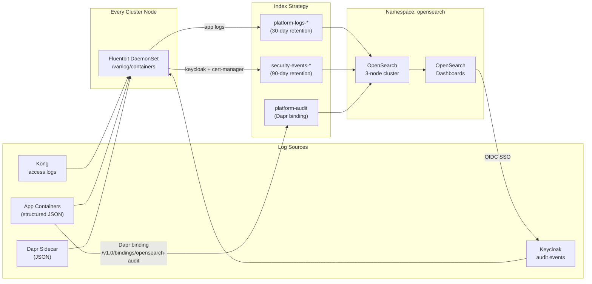

# Observability — Logging with OpenSearch

The platform uses **OpenSearch** for log aggregation, full-text search, and security analytics.
**Fluentbit** runs as a DaemonSet on every node, collecting and routing logs to OpenSearch.
**OpenSearch Dashboards** provides the UI with Keycloak OIDC single sign-on.

## Architecture



## Components

| Component | Chart | Namespace | Purpose |
|-----------|-------|-----------|---------|
| OpenSearch | `opensearch/opensearch` | `opensearch` | Search & analytics backend |
| OpenSearch Dashboards | `opensearch/opensearch-dashboards` | `opensearch` | Kibana-compatible UI |
| Fluentbit | `fluent/fluent-bit` | `logging` | Log collection DaemonSet |
| Kong HTTP Log plugin | `KongClusterPlugin` | cluster | Structured access log forwarding |
| Dapr Output Binding | `dapr.io/v1alpha1 Component` | `apps` | App audit event writes |

## Installing

```bash
helm repo add opensearch https://opensearch-project.github.io/helm-charts
helm repo add fluent     https://fluent.github.io/helm-charts
helm repo update

# Namespaces
kubectl apply -f k8s/opensearch/namespace.yaml

# OpenSearch cluster
helm upgrade --install opensearch opensearch/opensearch \
  --namespace opensearch \
  --values k8s/opensearch/helm-values.yaml \
  --wait --timeout 10m

# OpenSearch Dashboards
helm upgrade --install opensearch-dashboards opensearch/opensearch-dashboards \
  --namespace opensearch \
  --values k8s/opensearch/dashboards-values.yaml \
  --wait

# Fluentbit DaemonSet
helm upgrade --install fluent-bit fluent/fluent-bit \
  --namespace logging \
  --values k8s/logging/fluentbit-values.yaml \
  --wait

# ISM index policies (applied once)
kubectl apply -f k8s/opensearch/index-policies.yaml

# Dapr audit binding
kubectl apply -f k8s/opensearch/dapr-binding.yaml

# Kong global logging plugin
kubectl apply -f k8s/kong/plugins/logging-opensearch.yaml
```

## Secrets required

```bash
# OpenSearch admin + service accounts
kubectl create secret generic opensearch-secret \
  --from-literal=admin-password='<strong-password>' \
  --from-literal=fluentbit-password='<fluentbit-password>' \
  --from-literal=dashboards-password='<dashboards-password>' \
  --namespace opensearch

# OpenSearch Dashboards (OIDC + UI password)
kubectl create secret generic opensearch-dashboards-secret \
  --from-literal=password='<dashboards-password>' \
  --from-literal=keycloak-client-secret='<opensearch-keycloak-client-secret>' \
  --namespace opensearch
```

## Keycloak client for OpenSearch Dashboards

Add to `k8s/keycloak/realm-config.yaml` under `clients[]`:

```json
{
  "clientId": "opensearch-dashboards",
  "name": "OpenSearch Dashboards",
  "enabled": true,
  "clientAuthenticatorType": "client-secret",
  "secret": "opensearch-dashboards-secret-change-me",
  "redirectUris": ["https://logs.example.com/*"],
  "webOrigins": ["https://logs.example.com"],
  "standardFlowEnabled": true,
  "protocol": "openid-connect"
}
```

## Index strategy

| Index pattern | Source | Retention | Notes |
|---------------|--------|-----------|-------|
| `platform-logs-*` | All app containers, Dapr, Kong | 30 days | Rolled daily or at 5 GB |
| `security-events-*` | Keycloak, cert-manager, K8s audit | 90 days | Compliance / audit trail |
| `platform-audit` | Dapr output binding | Indefinite | App-emitted structured audit events |

ISM policies in `k8s/opensearch/index-policies.yaml` automate the hot → warm → delete lifecycle.

## Writing audit events from applications (Dapr binding)

Any Dapr-enabled app can write structured audit events without an OpenSearch SDK:

```bash
# From within a pod:
curl -X POST http://localhost:3500/v1.0/bindings/opensearch-audit \
  -H "Content-Type: application/json" \
  -d '{
    "data": {
      "timestamp": "2024-01-15T10:30:00Z",
      "event_type": "user.login",
      "user_id": "sub-123",
      "resource": "/api/v1/orders",
      "result": "success",
      "ip": "1.2.3.4"
    },
    "operation": "create"
  }'
```

## OpenSearch vs Elasticsearch

Both options are supported. To use **Elasticsearch + Kibana** instead:

```bash
# Use ECK (Elastic Cloud on Kubernetes) operator
helm repo add elastic https://helm.elastic.co
helm upgrade --install elastic-operator elastic/eck-operator \
  --namespace elastic-system --create-namespace

# Then create an Elasticsearch + Kibana resource via CRDs
# See: https://www.elastic.co/guide/en/cloud-on-k8s/current/k8s-quickstart.html
```

The Fluentbit output plugin and Dapr binding both support Elasticsearch natively —
change `opensearch` → `es` in the Fluentbit output and update the host/port.

## Pre-built Dashboards

Import these saved objects into OpenSearch Dashboards after first boot:

| Dashboard | Description |
|-----------|-------------|
| **Kong Access Logs** | Request rate, latency p50/p95/p99, error rates, top routes |
| **Dapr Operations** | State store calls, pub/sub throughput, sidecar errors |
| **Keycloak Security** | Login attempts, failures, brute-force triggers, token issuance |
| **Platform Overview** | Combined view: all namespaces, log volume, error rate trends |

To create index patterns after install:
1. Open `https://logs.example.com`
2. Management → Index Patterns → Create
3. Pattern: `platform-logs-*`, time field: `@timestamp`
4. Repeat for `security-events-*` and `platform-audit`
