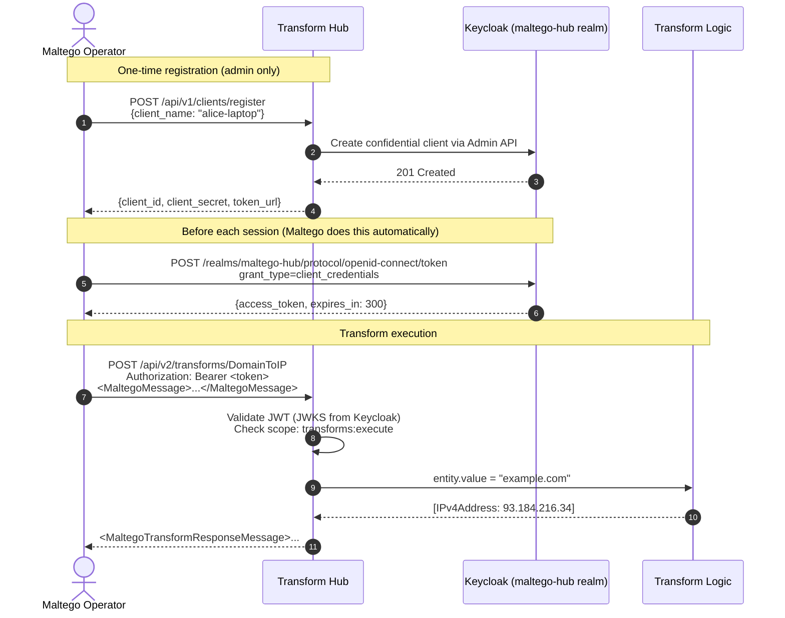

# Maltego Transform Hub

An open-source replacement for the Maltego iTDS (Integrated Transform
Distribution Server) and the commercial on-prem ID subscription.

Maltego clients authenticate to **Keycloak** (`maltego-hub` realm) using
OAuth2 client credentials, receive a short-lived bearer token, and call
transform endpoints directly — no Maltego cloud dependency, no per-seat iTDS fee.

---

## Architecture



---

## Available Transforms

| Transform Name | Input Entity | Output Entities | Description |
|----------------|-------------|-----------------|-------------|
| `DomainToIP` | `maltego.Domain` | `maltego.IPv4Address` | DNS A-record resolution |
| `DomainToMX` | `maltego.Domain` | `maltego.MXRecord`, `maltego.Domain` | Mail exchange records |
| `DomainToWhois` | `maltego.Domain` | `maltego.Person`, `maltego.Organization`, `maltego.EmailAddress`, `maltego.PhoneNumber` | RDAP/WHOIS data |
| `URLToDomain` | `maltego.URL` | `maltego.Domain`, `maltego.IPv4Address` | URL decomposition + DNS |
| `IPToGeoLocation` | `maltego.IPv4Address` | `maltego.Location`, `maltego.AS`, `maltego.Organization` | GeoIP + ASN lookup |

Discover all transforms programmatically:
```bash
curl -H "Authorization: Bearer $TOKEN" \
  https://api.example.com/transforms/api/v2/transforms
```

---

## Quick Start

### 1 — Deploy the service

```bash
# Create the Keycloak realm
kubectl apply -f k8s/keycloak/maltego-realm-config.yaml
# (Restart Keycloak or re-import the realm via Admin UI)

# Create K8s secrets
kubectl create secret generic transform-hub-secrets \
  --from-literal=keycloak-admin-client-secret='<transform-hub-admin-secret>' \
  --namespace apps

# Deploy
kubectl apply -f k8s/apps/transform-hub/
```

### 2 — Register your Maltego client

You need an admin bearer token first (with `transforms:admin` scope).
The `maltego-desktop` Keycloak client ships with `transforms:execute` only;
request an admin token from your platform team or use the `transform-hub-admin` client directly:

```bash
ADMIN_TOKEN=$(curl -s -X POST \
  "https://auth.example.com/realms/maltego-hub/protocol/openid-connect/token" \
  -d "grant_type=client_credentials" \
  -d "client_id=transform-hub-admin" \
  -d "client_secret=<transform-hub-admin-secret>" \
  -d "scope=transforms:admin" \
  | jq -r .access_token)

curl -s -X POST \
  "https://api.example.com/transforms/api/v1/clients/register" \
  -H "Authorization: Bearer $ADMIN_TOKEN" \
  -H "Content-Type: application/json" \
  -d '{"client_name": "alice-laptop", "description": "Alice analyst workstation"}' \
  | jq .
# Returns: { client_id, client_secret, token_url, instructions }
```

### 3 — Get a transform bearer token

```bash
TOKEN=$(curl -s -X POST \
  "https://auth.example.com/realms/maltego-hub/protocol/openid-connect/token" \
  -d "grant_type=client_credentials" \
  -d "client_id=<your-client_id>" \
  -d "client_secret=<your-client_secret>" \
  -d "scope=transforms:execute" \
  | jq -r .access_token)
```

Or use the convenience proxy endpoint:

```bash
TOKEN=$(curl -s -X POST \
  "https://api.example.com/transforms/api/v1/clients/token" \
  -H "Content-Type: application/json" \
  -d '{"client_id": "<id>", "client_secret": "<secret>"}' \
  | jq -r .access_token)
```

### 4 — Execute a transform (XML)

```bash
curl -s -X POST \
  "https://api.example.com/transforms/api/v2/transforms/DomainToIP" \
  -H "Authorization: Bearer $TOKEN" \
  -H "Content-Type: application/xml" \
  -d '<?xml version="1.0"?>
<MaltegoMessage>
  <MaltegoTransformRequestMessage>
    <Entities>
      <Entity Type="maltego.Domain">
        <Value>example.com</Value>
      </Entity>
    </Entities>
    <Limits SoftLimit="12" HardLimit="255"/>
  </MaltegoTransformRequestMessage>
</MaltegoMessage>'
```

### 5 — Execute a transform (JSON)

```bash
curl -s -X POST \
  "https://api.example.com/transforms/api/v2/transforms/IPToGeoLocation" \
  -H "Authorization: Bearer $TOKEN" \
  -H "Content-Type: application/json" \
  -d '{
    "Entities": {
      "Entity": [{"Type": "maltego.IPv4Address", "Value": "8.8.8.8"}]
    },
    "Limits": {"SoftLimit": 12, "HardLimit": 255}
  }'
```

---

## Configuring the Maltego Desktop Client

1. Open Maltego → **Settings** → **Advanced** → **Transform Servers** → **Add**
2. Fill in:

| Field | Value |
|-------|-------|
| **Name** | Platform Transform Hub |
| **Base URL** | `https://api.example.com/transforms` |
| **Authentication** | OAuth2 Client Credentials |
| **Token URL** | `https://auth.example.com/realms/maltego-hub/protocol/openid-connect/token` |
| **Client ID** | *(from registration step)* |
| **Client Secret** | *(from registration step)* |
| **Scope** | `transforms:execute` |

3. Click **Fetch Transforms** — Maltego calls `GET /api/v2/manifest` and
   imports all available transforms automatically.

Maltego will cache the token and refresh it transparently before expiry (300 s).

---

## Adding Your Own Transform

Create a new file in `src/transform-hub/transforms/`, e.g. `email_to_breach.py`:

```python
from .. import transforms as registry
from ..models.maltego import MaltegoEntity, TransformRequest, TransformResponse
from .base import BaseTransform, TransformMeta

@registry.register
class EmailToBreach(BaseTransform):
    name = "EmailToBreach"
    meta = TransformMeta(
        name="EmailToBreach",
        display_name="Email To Breach Data",
        description="Checks if an email appears in known breach datasets.",
        input_entity="maltego.EmailAddress",
        output_entities=["maltego.Phrase"],  # breach name
    )

    def run(self, entity: MaltegoEntity, request: TransformRequest) -> TransformResponse:
        email = entity.value.strip().lower()
        response = TransformResponse()

        # Your lookup logic here —
        # e.g. query your internal breach database, call an API, etc.
        breaches = lookup_breaches(email)   # implement this

        for breach in breaches:
            result = MaltegoEntity(type="maltego.Phrase", value=breach["name"])
            result.add_field("breach.date", breach["date"], "Breach Date")
            result.add_field("breach.count", str(breach["count"]), "Records")
            response.add_entity(result)

        response.inform(f"Found {len(breaches)} breach(es) for {email}")
        return response
```

Rebuild and redeploy — the transform is picked up automatically via the
`_autodiscover()` call in `transforms/__init__.py`. No restart required if
using hot-reload in dev (`uvicorn --reload`).

---

## Keycloak `maltego-hub` Realm — Client Overview

| Client ID | Grant Type | Purpose |
|-----------|-----------|---------|
| `transform-hub` | *(bearer-only)* | JWT audience — the hub validates tokens for this `aud` |
| `transform-hub-admin` | `client_credentials` | Hub service manages clients via Keycloak Admin API |
| `maltego-desktop` | `client_credentials` | Default operator client shipped with the hub |
| *(registered clients)* | `client_credentials` | One per Maltego operator workstation |

## Security Properties

| Property | Implementation |
|----------|---------------|
| **Token validation** | RS256 JWT, verified against Keycloak JWKS; JWKS cached 10 min, auto-refreshed on key rotation |
| **Scope enforcement** | `transforms:execute` required on every transform call; `transforms:admin` for registration |
| **Token expiry** | 300 s access tokens; Maltego client refreshes automatically |
| **Rate limiting** | Kong `rate-limiting-strict` plugin (20 req/min per client) applied at ingress |
| **Brute-force protection** | Keycloak realm: locked after 10 failed attempts |
| **Transport** | TLS enforced via cert-manager + Let's Encrypt; all intra-cluster calls over plain HTTP |
| **Audit log** | All Keycloak login events → `security-events-*` OpenSearch index via Fluentbit |
